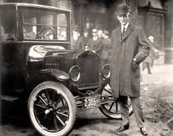

# CHAPTER 24
## The Jazz age
### Redefining the Nation, 1919-1929

Citizens wanted a more comfortable life and wanted luxuries

Production of popular entertainment was being introduced

News reels would be played in the theaters

- Silent films were popular 

Henry ford revolutionized distributing the motor vehicles 

Mass spread of cars increased steel glass and oil companies 

- Hotels also profited from the increase levels of travel

## Homogenization 
- thinking the same thing

Radios broadcasting across the country causing everyone to hear the same news
This would lead to similar thinking

The idea that if its different they wouldn’t care about it

Tennessee would be important during the Butler Act
U couldn’t teach the theory of evolution in Tennessee because it was against their Christianity

This was the first radio broadcasted court hearing

## 24.3 A New Generation 
### A new morality

The Harlem renaissance 
-The jazz age
The “New Negro”
-Negro Nationalism
Proud of your heritage and the culture
Encouraged african americans to help eachother and promote things like black literature 

- Black start streamship line

## Prohibition 

- Banned alcohol distribution, selling and production
- However alcohol consumption was okay
- This led to hidden bars
- Bartenders would only tell those who are trustworthy

.jpeg "underground bar")

### Anti-Saloon league
They pushed for the 18th amendment to be passed(banned alcohol)

- Organized crime
- Murder
- Prostitution
- Gambling
- Bootlegging alcohol

### Politics in the 1920’s
- Warren G. Harding 
- Bussiness model of government 
- Some accomplishments
- Teapot Dome Scandal
- Took bribes to let people drill in spots

 He introduced the idea that the government presents reports of the money spent to congress to negate the costs that came from ww1
