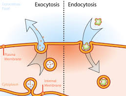
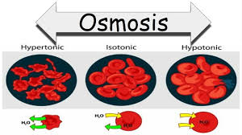

# Cell Transport

| Exocytosis|Endocytosis |
|:-----:| :-----:|
|The proccess of transporting molecules of outside the cell| The proccess of ingesting large particles, bacteria and macromolecules|

| Phagocytosis|pinocytosis |
|:-----:| :-----:|
|The proccess of ingesting other cells and particles| The proccess where the cell takes in fluid and dissolves small molecules|

| Receptor Mediated Endocytosis| Diffusion |
|:-----:| :-----:|
|the proccess of the receptor proteins capturing targeted molecules| Net movement of generally anything from higher to lower concentration|

| Hypertonic|Hypotonic |
|:-----:| :-----:|
|having a higher osmatic pressure than the other cell| having a lower osmatic pressure than the other cell|

